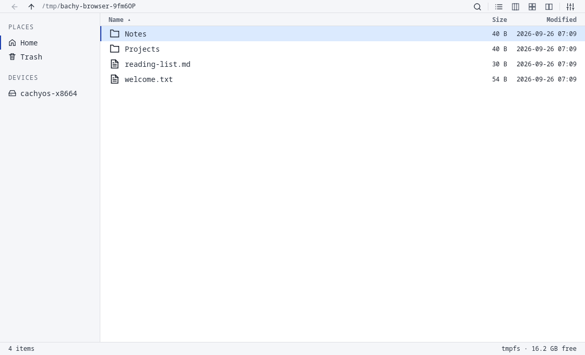

<p align="center">
  
</p>

# Bachy

**A keyboard-first file manager for CachyOS and Hyprland.**

Bachy is an independent fork of [Flea](https://github.com/thisisgm/flea), with a Rust backend and a Quickshell/Qt Quick interface. It keeps Flea's fast, viewport-based browser while replacing its Omarchy shell dependencies with local components.

**Status: experimental, 0.1.0.** Basic browsing and file operations work, but this is not yet a complete replacement for Thunar, Nautilus or Dolphin. In particular, **file clipboard contents do not cross separate windows, copied files do not preserve all metadata, and folder collisions cannot be merged**. Read the [limitations](LIMITATIONS.md) before relying on it for important transfers.

[Features](FEATURES.md) · [Installation](docs/bachy.md) · [Limitations](LIMITATIONS.md) · [Roadmap](ROADMAP.md) · [Verification](docs/BACHY-VERIFICATION.md)



## What it does today

- List, grid, Miller-column and dual-pane browsing; tabs, history, favourites and hidden-file toggle.
- Keyboard presets, multi-selection and recursive fuzzy filename/path search.
- Copy, move, single rename, duplicate, Trash/restore, permanent deletion, and undo/redo where supported.
- Quick Look and a preview column for supported images, text, PDFs, media and archives.
- Default-application opening, Open With, scripts, archive creation/extraction and optional image conversion.
- GIO/GVFS-backed network/device access, FileManager1 “Show in folder”, and a packaged file-chooser portal.

Some integrations need extra packages or services and have not been tested against real devices. [Feature status and dependencies →](FEATURES.md)

## Install on CachyOS / Arch Linux

[Download the experimental 0.1.0 x86-64 package](https://github.com/Paul-M-Kallarackal/Bachy/releases/tag/v0.1.0) to install without compiling. Use a fully updated CachyOS or Arch Linux system with access to the official runtime dependencies, including Quickshell 0.3.1 or newer.

After downloading `bachy-0.1.0-1-x86_64.pkg.tar.zst` and `SHA256SUMS` into the same directory:

```sh
sha256sum -c SHA256SUMS
sudo pacman -U ./bachy-0.1.0-1-x86_64.pkg.tar.zst
bachy --gui
```

`pacman` resolves the package's runtime dependencies from your enabled repositories. This is a native package-manager installation, not a verified one-click desktop installer. The download is for x86-64 only; it is not an AppImage and does not bundle Qt or Quickshell. See the release notes for validation and known limits.

### Build from source

Install Git, Rust and the Arch build tools, then clone and build:

```sh
sudo pacman -S --needed git base-devel rust
git clone https://github.com/Paul-M-Kallarackal/Bachy.git
cd Bachy
makepkg -si
bachy --gui
```

`PKGBUILD` declares the runtime dependencies. On current source/package revision 0.1.0-2, graphical PDF preview is optional: install `qt6-webengine` and restart Bachy to enable it. Without it, PDFs can still open in your default application. The original v0.1.0 release download predates this change. If your enabled repositories cannot resolve Quickshell or another dependency, install the missing dependency first; do not skip dependency checks for a normal installation. No AUR listing is currently maintained.

For development, with the runtime dependencies installed:

```sh
cargo build --release --locked
./run-bachy --gui
```

The ignored `.runtime/` directory is an optional local development convenience, **not included in this repository**. A clean clone requires a system Quickshell installation.

## Hyprland integration

For current Hyprland Lua configurations:

```lua
hl.bind("SUPER + E", hl.dsp.exec_cmd("bachy --gui"))
hl.window_rule({
    match = { class = "^(local\\.bachy\\.FileManager)$" },
    float = true,
    center = true,
    size = { "monitor_w*0.50", "monitor_h*0.55" },
})
```

Replace an existing file-manager binding rather than defining the same chord twice. Bachy does not rewrite your compositor configuration. Older Hyprland syntax, application activation and default-handler setup are explained in the [setup guide](docs/bachy.md).

To make Bachy the **folder handler only**:

```sh
xdg-mime default local.bachy.FileManager.desktop inode/directory
```

`bachy --default` additionally claims FileManager1 routing and, **when its portal backend is installed**, file-chooser routing. This is broader than setting the folder MIME handler. See the setup guide before enabling it.

## First-launch performance

On one tested Intel/NVIDIA laptop, opening the first usable listing improved from approximately **2.8 seconds to 0.25–0.27 seconds** by avoiding a synchronous NVIDIA wake-up. The source launcher opens on Intel first and checks NVIDIA in the background; later windows can use a checked, awake NVIDIA GPU. After NVIDIA sleeps, it uses Intel again.

These are measurements from one machine with a sleeping discrete GPU, **not reboot-cold benchmarks or cross-machine guarantees**. The packaged `bachy` binary currently uses the original automatic renderer selection; the hybrid policy lives in `run-bachy`. Making that policy configurable and consistent across installation methods is on the roadmap.

## Development

```sh
cargo test --release --locked
bash tests/js.sh
bash tests/keymap-gen.sh
```

The latest local core check recorded **852 Rust tests and 3,967 JavaScript checks passing**. The complete inherited integration runner is **not green**; see [verification and prerequisites](docs/BACHY-VERIFICATION.md). Run destructive-operation tests only in disposable fixtures with the repository's sandbox guard enabled.

## Credits and license

Based on Flea by GM, at the commit recorded in [UPSTREAM.md](UPSTREAM.md). Original attribution and the [MIT license](LICENSE) are preserved. Bachy is not an official CachyOS, Hyprland, Omarchy or Flea product.

The generated logo and its source prompts are in [docs/assets](docs/assets/README.md). Historical Flea design notes, screenshots and benchmark material remain for provenance; they are not Bachy results.
